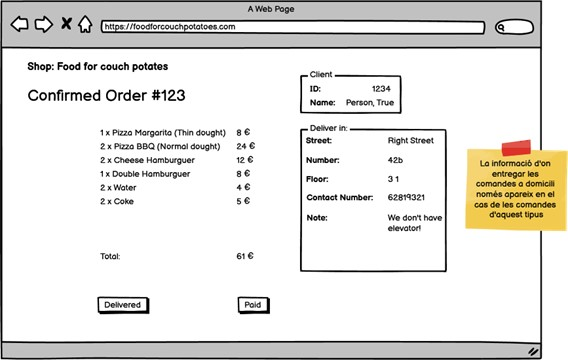

# MongoDB data structure

Development of MongoDB database structures for managing an optician's office, a food delivery store, and a scaled-down version of YouTube.

### Level 1 - Optic

The project focuses on managing an optician's office called. Here are the key points detailed:

| **Collections** | **Attributes**                                                                                                           |
| --------------- | ----------------------------------------------------------------------------------------------------------------------- |
| Suppliers     | Name, address (street, number, floor, door, city, postal code, country), telephone, fax, NIF.                       |
| Glasses           | Brand, glass prescription, type of frame (floating, paste or metallic), frame color, glass color, price. |
| Customers        | Name, postal address, telephone, email, registration date, client-recommender.                         |
| Sales          | Employee who made the sale, date and time of the sale.                                                                |

#### Modeling:

1. **Database design according to the customer's view of the optician.**

- The exercise asks you to consider the information necessary to display the graphical interface provided.

    

2. **Design of the database according to the vision of the glasses.**

- The exercise asks you to consider the information necessary to display the glasses interface.

    

### Level 2 - Food delivery store

This level focuses on the design of an ordering website for a food delivery ordering store. Highlights:

| **Collections**      | **Attributes**                                                            |
| -------------------- | ------------------------------------------------------------------------ |
| Customers             | Unique identifier, name, address, zip code, telephone number.         |
| Orders              | Date/time, type of delivery, products (quantity and types), total price. |
| Products            | Unique identifier, name, description, image, price, etc..                |
| Categories of Pizzas | Unique identifier, name.                                             |
| Employees            | Unique identifier, name, surname, ID number, telephone number, role.              |

### Modeling:

1. **Database design for online order management.**

- The exercise asks you to consider the information needed to manage orders, customers and products.

  

2. **Database design from a pizza perspective.**

- The exercise asks you to consider the information needed to manage the different pizza categories and products.

### Level 3 - YouTube

This level represents a reduced version of YouTube with the following features:

| **Collections**        | **Attributes**                                                                                                       |
| ---------------------- | ------------------------------------------------------------------------------------------------------------------- |
| Users               | id, email, password, username, date of birth, gender, country, zip code.                           |
| Videos                 | id, title, description, size, video file name, duration, thumbnail, views, likes, dislikes. |
| Channels                | id, name, description, creation date.                                                                         |
| Playlists | id, name, creation date, status (public or private).                                                          |

#### Modeling:

1. **Database design for a scaled-down version of YouTube.**
- The exercise asks you to consider the information needed to manage users, videos, channels and playlists.

 

## License

This project is distributed under the Apache 2.0 license.

---

Developed by [Fanur Khusainov](https://www.linkedin.com/in/fanur-khusainov-ab86b2102/) with ❤️ and ☕.
